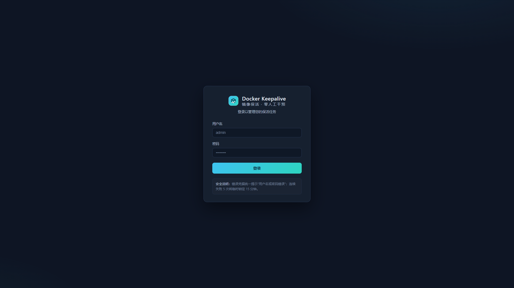
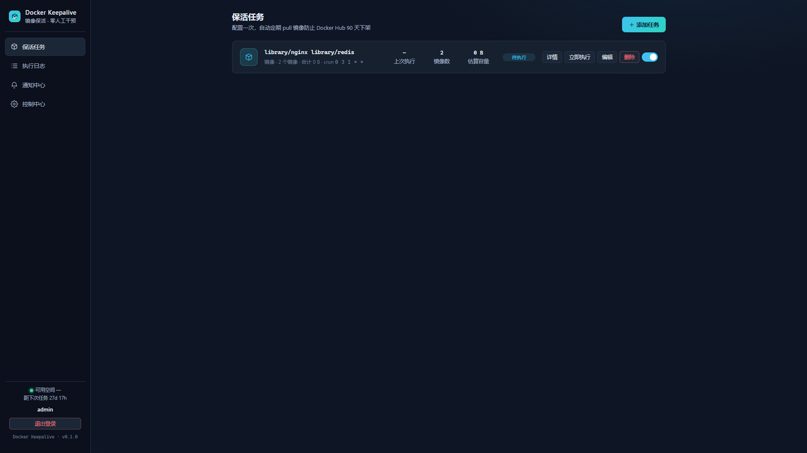
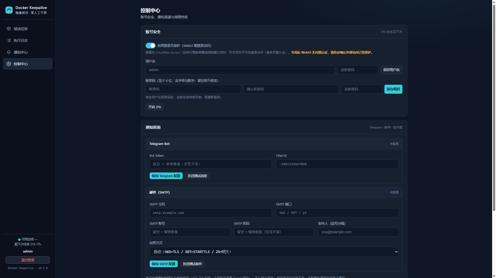

# Docker Hub 镜像保活工具（dockerhub-keepalive）

[](LICENSE)
[](https://hub.docker.com/r/neostry/dockerhub-keepalive)
<!-- 徽章占位（仓库转公开后补充）：GitHub Release / Stars / Forks（私有仓库 shields.io 无法读取） -->

自动维护你的 Docker Hub 镜像：定期 pull 保活，防止镜像因 **90 天未拉取被 Docker Hub 下架**。带 WebUI，部署在 VPS 上，配置一次后**零人工干预**。

## 为什么需要它

Docker Hub 对 **90 天内无人 pull 的镜像**存在下架风险。许多开源项目没有官方镜像，自建/搬运的镜像一旦被下架就无法再使用。本工具定时帮你 pull 一遍，让镜像"永远活着"。

## 功能特性

- 🔐 **登录保护体系**：单用户登录（首次访问引导设置账号，无默认密码）、密码 Argon2id 哈希存储、可选 2FA（TOTP，含密钥文本与复制按钮）、登录失败限速 + 临时锁定（防暴力破解）；支持修改用户名/密码；**登录保护开关（F5a）**——可关闭登录页，适配 Cloudflare Access 等外部访问控制场景（默认开启，关闭需确认 + 风险提示）
- 🖥️ **WebUI 配置**：两种镜像输入方式——① 填写 Docker Hub 用户名（自动分页扫描其下全部镜像，展示镜像名/最新 tag/简介/**估算容量**/更新时间与合计容量）② 单个镜像路径（`namespace/repo`，支持多行批量）；每个任务独立 cron 表达式（默认示例：每月 1 日 03:00 `0 3 1 * *`）
- 🔄 **自动保活**：定时 pull 镜像完成保活 → 完成后**自动删除本地镜像**释放 VPS 空间；执行前自动**空间预检**（估算容量 vs 服务器可用空间，不足自动跳过并告警）；默认逐个「拉取 → 删除 → 下一个」，空间充足时自动受控并发
- 🧹 **清理兜底**：删除失败自动重试（指数退避）+ 可选深度清理（`docker image prune`，仅清理 dangling 镜像）+ 可选定时重启容器兜底 + 「立即执行清理」手动按钮
- 📝 **任务日志**：每次执行记录时间、触发方式、镜像列表、逐镜像成功/失败明细、耗时、清理结果，时间倒序分页可回溯
- 📣 **三通道通知**：站内信（WebUI 通知中心，未读标记/一键已读）+ Telegram bot + 邮件 SMTP，执行完成后发送汇总报告；三通道互备——任一通道失败不影响其他通道与任务本身
- 🗂️ **任务管理**：任务卡片展示镜像数/估算容量/上次执行结果/下次执行时间；用户名任务可查看任务详情（仓库元信息快照 + Docker Hub 头像，加载失败回退默认图标）
- 🐳 **Docker 原生部署**：docker compose 一键启动，通过挂载 `/var/run/docker.sock` 操作宿主 Docker；SQLite 单文件存储（WAL），数据随数据卷持久化，重启不丢失

## 截图

| 登录页 | 任务列表 | 控制中心 |
| --- | --- | --- |
|  |  |  |

## 快速开始

> 完整部署说明（含故障排查/回滚）见部署文档（项目内部管理文档，不随仓库发布）；快速开始见下文。

**前置条件**：Linux VPS 已安装 Docker Engine 与 Docker Compose v2；建议 2GB+ 可用磁盘。

### 1. 克隆仓库

```bash
git clone https://github.com/Neostry/dockerhub-keepalive.git
cd dockerhub-keepalive
```

### 2. 配置环境变量

```bash
# 生成主密钥（AES-256 加密通知凭证/2FA 密钥；缺失时服务拒绝启动）
openssl rand -hex 32

cp configs/.env.example .env
# 编辑 .env：必填 APP_SECRET_KEY=<上一步输出>；按需调整 TZ（建议 Asia/Shanghai）、WEB_PORT 等
```

### 3. 启动

```bash
docker compose up -d        # 直接使用已发布镜像 neostry/dockerhub-keepalive:latest，无需本地构建
docker compose ps           # 等待 Up (healthy)
curl http://127.0.0.1:8080/api/health   # 返回 {"ok":true}
```

> 默认配置即可运行（`APP_SECRET_KEY`/`TZ`/`WEB_PORT` 三个变量）。如需调整登录限速、扫描上限、重试次数等，见下方「环境变量」表，按 `变量名: "${变量名:-默认值}"` 格式自行添加到 `docker-compose.yml` 的 `environment` 下（或写入 `.env`）。

### 4. 打开 WebUI 配置

访问 `http://<vps-ip>:8080`：

1. 首次访问引导设置用户名/密码（≥8 位含字母数字，无默认密码）
2. 添加镜像来源：Docker Hub 用户名（自动扫描）或单个镜像路径（`namespace/repo`）
3. 设置 cron 时间，保存即可——下次定时任务自动执行

通知凭证（Telegram bot token / SMTP 密码）在 WebUI **控制中心**表单中填写，经 AES-256 加密后入库，无需写入任何环境变量。

## 工作原理

```
[cron 触发 / 手动执行] → [空间预检] → [Docker Hub 扫描/列 tag]
→ [逐个 pull 完成保活] → [成功后立即 rmi 删除释放空间]
→ [记录日志 + 站内信] → [Telegram / 邮件通知]
```

- **保活对象**：`username` 型任务按勾选仓库快照保活；`image` 型任务按镜像路径保活；未指定 tag 时取该仓库最近更新的前 `MAX_TAGS_PER_REPO` 个 tag（默认 20，可配）
- **执行模型**：全局串行队列 + 任务级单飞锁（同一任务执行中，后到触发自动跳过）；任务内受控并发（空间充足自动升到 3，否则逐个执行）
- **清理策略**：镜像 pull 成功后立即 `rmi` 删除（无需持久化映射）；删除失败自动重试，最终失败可选 `image prune` 深度兜底
- **通知**：站内信必达（与配置同库存储）；Telegram / 邮件按配置发送，未配置的通道自动跳过，失败自动重试（默认 3 次、指数退避）

## 安全说明

- **无 Docker Hub 账号凭证**：仅 pull 公开镜像，只需用户名/镜像路径，无需任何 Docker Hub 凭据
- **登录保护**：单用户登录（首次访问引导设置用户名/密码，无默认密码）；密码 Argon2id 哈希存储；可选 2FA（TOTP，RFC 6238）；登录失败限速 + 临时锁定（按 IP 维度持久化，重启不绕过）；**登录保护开关默认开启**，关闭需确认 + 风险提示，仅建议配合 Cloudflare Access / 反向代理等外部访问控制使用
- **凭证加密存储**：Telegram bot token、SMTP 密码、TOTP 密钥经 **AES-256-GCM 加密后入库**（主密钥 `APP_SECRET_KEY` 来自部署 Secret，缺失 fail-fast）；敏感字段**仅写不读**——API 永不回传密文，数据库文件不含明文凭证
- **会话安全**：会话 token 哈希存储 + HttpOnly Cookie；修改密码/用户名后吊销全部会话
- **反代安全**：`TRUST_PROXY` 默认关闭（防 X-Forwarded-For 伪造）；HTTPS 反代场景启用 `COOKIE_SECURE`
- **部署安全**：容器以 root 运行并挂载宿主 `docker.sock`（rw）与宿主根 `/`（ro）——等效宿主管理员权限，**仅限部署在自有可信 VPS**，禁止共享/不可信主机；`/:/host` 只读，空间预检只读 `statfs`
- 项目中**不硬编码任何敏感信息**；`.env` 已被 `.gitignore`/`.dockerignore` 排除，发布仓库与镜像中不含任何凭证

## 环境变量

> `docker-compose.yml` 默认仅含 **`APP_SECRET_KEY` / `TZ` / `WEB_PORT`** 三个变量即可运行；下表其余变量为可选，需要时按 `变量名: "${变量名:-默认值}"` 格式自行添加到 compose 的 `environment` 下（或写入 `.env`）。

| 变量 | 默认 | 必填 | 说明 |
| ---- | ---- | ---- | ---- |
| `APP_SECRET_KEY` | — | ✅ | 主密钥（AES-256 加密，缺失拒绝启动；`openssl rand -hex 32` 生成） |
| `WEB_PORT` | 8080 | | 监听与映射端口 |
| `TZ` | Asia/Shanghai | | cron 时区 |
| `TRUST_PROXY` | 0 | | 反代场景置 1（信任 X-Forwarded-For） |
| `COOKIE_SECURE` | 0 | | HTTPS 反代场景置 1（Cookie Secure 标志） |
| `LOGIN_MAX_FAILURES` | 5 | | 登录失败阈值 |
| `LOGIN_LOCK_MINUTES` | 15 | | 锁定分钟数 |
| `SESSION_TTL_DAYS` | 30 | | 会话有效期（天） |
| `MAX_REPOS_SCAN` | 50 | | 用户名扫描仓库上限（0=不限） |
| `MAX_TAGS_PER_REPO` | 20 | | 单仓库拉取 tag 上限（0=全部） |
| `PULL_RETRIES` | 3 | | pull/rmi 重试次数 |
| `NOTIFY_RETRIES` | 3 | | 通知重试次数 |
| `SPACE_HEADROOM` | 1.1 | | 空间预检余量系数 |

> 完整清单与补充可配项见部署文档 §4.1（完整文档为项目内部管理文档，不随开源仓库发布）与后端实现说明 §7。通知凭证（bot token / SMTP 密码）**不走环境变量**，在控制中心表单配置后加密入库。

## 文档

> 完整文档（项目说明书、PRD、系统架构设计、API 文档、部署文档、运维手册）为项目内部管理文档，不随本仓库发布；详见项目本地 `_vibe-coding/docs/`。本仓库聚焦代码、容器化与部署：`src/`（后端 + 前端）、`Dockerfile`、`docker-compose.yml`、`configs/.env.example`。

[CHANGELOG](CHANGELOG.md) 记录版本变更。

## FAQ

**Q：镜像已经被 Docker Hub 下架了，这个工具能恢复吗？**

不能。保活工具只对**尚未下架**的镜像有效——在 90 天窗口内定期 pull 防止下架。已下架的镜像无法通过 pull 恢复（Docker Hub 返回 manifest 不存在），需重新构建/重新上传。建议尽早配置。

**Q：支持私有仓库 / 需要 Docker Hub 账号登录吗？**

不支持也不需要。工具只保活**公开镜像**，pull 公开镜像无需任何 Docker Hub 凭据，因此不存储任何账号信息。私有仓库与多仓库同步在 PRD「暂不做什么」边界内，不在计划中。

**Q：会不会误删我 VPS 上其他镜像？**

不会误删使用中的镜像。工具只删除**自己刚刚 pull 的保活镜像**（`rmi` 精确指定 repo:tag）；可选深度清理 `image prune` 仅清理 **dangling**（无 tag 悬挂）镜像且默认关闭；可选「定时重启容器」默认关闭。所有兜底项均需显式开启。

**Q：容器挂载了 docker.sock，安全吗？**

挂载 docker.sock 使容器等效宿主管理员权限——这是保活工具操作宿主 Docker 的必需设计，因此**仅限部署在自有的可信 VPS**，禁止共享/不可信主机。配套措施：`/:/host` 只读挂载（容器无法写入宿主文件系统）、登录保护默认开启、`.env` 主密钥不入库。详见部署文档 §4.3。

**Q：通知凭证存在哪里？会不会泄露？**

Telegram bot token / SMTP 密码 / TOTP 密钥在**控制中心表单**填写，服务端用 **AES-256-GCM 加密**后存入 SQLite（主密钥 `APP_SECRET_KEY` 来自部署 Secret，缺失拒绝启动）。敏感字段**仅写不读**——API 永不回传密文，数据库文件不含明文。注意：更换 `APP_SECRET_KEY` 后旧凭证无法解密，需在控制中心重新填写。

**Q：任务执行失败了怎么办？**

每轮执行都有日志留痕（逐镜像成功/失败明细 + 原因），站内信必达。pull 失败自动重试（默认 3 次、指数退避 5s/15s/45s）；空间不足的任务自动跳过并告警。执行成功率 ≥ 99% 是设计目标，详细排查步骤见部署文档 §6。

**Q：如何升级 / 迁移到新 VPS？**

升级：`git pull` 或换镜像 tag 后 `docker compose up -d --build`（数据卷保留）。迁移：按运维手册备份 SQLite 数据卷（`docker cp` 导出备份文件），新 VPS 恢复后重启即可，任务/账号/日志/通知全部保留。

## 贡献

欢迎提交 Issue 与 Pull Request！

- **报告问题 / 提需求**：新建 GitHub Issue，说明复现步骤与期望行为（模板见仓库 `.github/`）
- **提 PR**：
  1. Fork 仓库并创建功能分支（`feature/xxx` 或 `fix/xxx`）
  2. 本地开发：`npm install` + `npm start`（后端 :8080）+ `cd src/web && npm run dev`（前端 :5173，/api 代理）
  3. 提交前跑测试：`npm test`（自动化 41 用例全部通过）+ 浏览器主流程冒烟
  4. 描述变更内容与影响范围，关联对应 Issue
- **行为准则**：不提交敏感信息（token/密码/密钥）；功能改动需同步 PRD/API 文档；遵循项目 AGENTS.md 协作规范

## 路线图

- **1.0.0（已发布）**：单用户登录 + 2FA + 两种镜像输入 + cron 调度 + pull/删除保活 + 清理兜底 + 日志 + 三通道通知 + SQLite + Docker 部署
- **后续（暂不承诺，见 PRD「暂不做什么」）**：多用户、私有仓库同步、统计面板、Webhook 等均不在计划内；以社区反馈为准评估

## License

[Apache-2.0](LICENSE) © dockerhub-keepalive contributors
